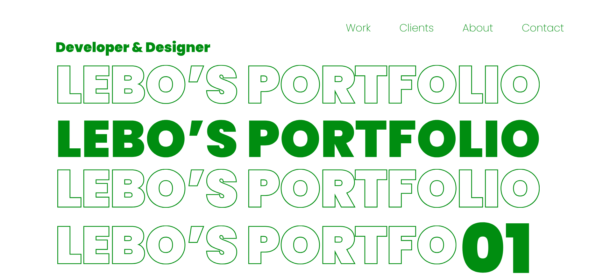

# **My Profile Website**



## **Overview**

This is a personal profile website designed to showcase my skills, projects, and experience. Built using HTML, CSS, and JavaScript, it features a clean, responsive design to offer visitors a pleasant browsing experience. The website includes sections like an About Me, Projects, Skills, and Contact information, all seamlessly integrated to highlight my work and interests.

## **Features**

- **Responsive Design**: The website is fully responsive, ensuring it looks great on all devices.
- **Smooth Navigation**: Easily navigate between sections such as About Me, Projects, Skills, and Contact.
- **Project Showcase**: A dedicated section to display my latest work and projects, including interactive elements.
- **Interactive Elements**: JavaScript-driven interactions, such as image carousels, project filters, and smooth scrolling.
- **Contact Form**: A contact section that allows visitors to reach out to me via a simple form.

## **Setup and Installation**

1. **Clone the Repository**:

   ```
   git clone https://github.com/Brilu-22/Brilu-s-portfolio.git
   ```

2. **Open the Website Locally**:

   - Navigate to the project directory:
     ```
     cd Brilu-s-portfolio
     ```
   - Open the `index.html` file in your preferred browser to view the website locally.

3. **Customization**:
   - Edit the `index.html` file to update personal information such as your name, bio, and contact details.
   - Update the `main.css` to customize the look and feel of the website.
   - Add or update project details in the `index.html` section.

## **Technologies Used**

- **HTML**: The structure of the website.
- **CSS**: Styling of the website for a responsive and visually appealing layout.
- **JavaScript**: Interactive features such as smooth scrolling, image sliders, and form validation.

## **Usage**

1. **Navigate Between Sections**:

   - Use the navigation bar to jump to different sections such as About Me, Projects, Skills, and Contact.

2. **View Projects**:

   - Browse through the project section to see details of my work.
   - Each project is linked to a dedicated page with more information and images.

3. **Interactive Elements**:
   - Use the interactive features like carousels and filters in the projects section to explore my work.

## **Credits**

This website was developed by Brilu Lebogang Hlongwane, a second-year student at Open Window, specializing in Development with skills in Creative Computing and 2D Animation.

## **License**

This project is licensed under the [MIT License](LICENSE).
